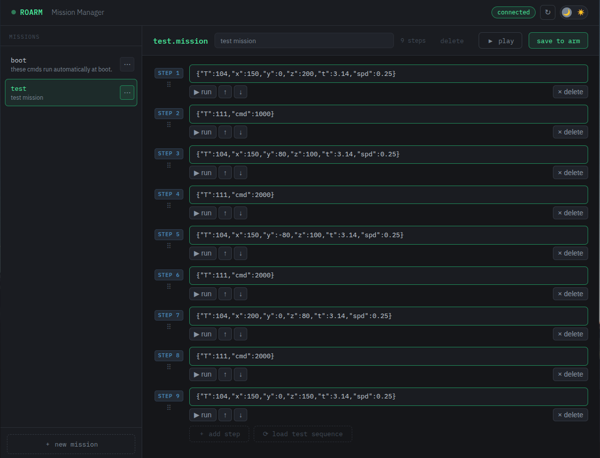

# RoArm Mission Manager

A browser-based mission file editor for the [Waveshare RoArm-M2-S](https://www.waveshare.com/wiki/RoArm-M2-S) robotic arm. Connects over USB serial (UART), reads mission files stored on the arm's ESP32 flash, and lets you create, edit, duplicate and run them without touching a serial terminal.

<picture>
  <source media="(prefers-color-scheme: dark)" srcset="screenshots/dark-mode.png">
  <source media="(prefers-color-scheme: light)" srcset="screenshots/light-mode.png">
  
</picture>

---

## Features

- **Browse missions** — lists all `.mission` files from the arm's flash storage
- **Edit steps** — each step is an editable JSON line with live validation (invalid JSON highlights red)
- **Reorder steps** — drag and drop, or use ↑ ↓ buttons; moved steps flash to confirm position
- **Run missions** — play a full mission or execute a single step directly from the editor
- **Stop playback** — sends an interrupt signal mid-mission
- **Create missions** — blank or copied from an existing mission
- **Duplicate missions** — copy any mission as a new name for versioning
- **Delete missions** — with confirmation
- **Test sequence** — built-in conservative movement sequence for first-time testing
- **Light / dark mode** — toggle in the toolbar, preference saved between sessions
- **Auto COM port detection** (Windows) — finds the arm by USB hardware ID even if the port number changes
- **Busy overlay** — spinner with status text during any operation that takes a moment

---

## Requirements

- Python 3.7 or newer
- [pyserial](https://pypi.org/project/pyserial/) — installed automatically by the setup scripts, or manually:
  ```bash
  pip install -r requirements.txt
  ```
- RoArm-M2-S connected via USB, running stock firmware at 115200 baud

---

## Installation

### Windows

1. Install [Python 3.7+](https://www.python.org/downloads/) — check **"Add Python to PATH"** during setup
2. Connect the arm via USB
3. Double-click **`install.bat`**
4. Follow the prompts — it detects your COM port by USB hardware ID and writes `launch.bat`

### Linux / macOS

1. Connect the arm via USB
2. Open a terminal in this folder and run:
   ```bash
   chmod +x install.sh
   ./install.sh
   ```
3. Follow the prompts — it detects your port and writes `launch.sh`

> **Linux note:** If you get `Permission denied` on the serial port, the installer will offer to add you to the `dialout` group. You need to log out and back in once for this to take effect.

---

## Usage

### Starting the server

**Windows:** double-click `launch.bat`

**macOS:** double-click `Launch RoArm Manager.command` in Finder, or run `./launch.sh`

**Linux:** run `./launch.sh` in a terminal

The browser opens automatically at `http://localhost:5000`. The terminal window must stay open while you're using the tool — it's the bridge between the browser and the arm.

### Editor workflow

1. Select a mission from the sidebar to open it
2. Edit steps directly — each line is a JSON command
3. Use the action bar below each step to run ▶, reorder ↑ ↓, or delete it
4. **Save to arm** (or `Ctrl+S`) writes all changes back — this deletes and recreates the mission file on the arm
5. **▶ play** runs the full mission; **■ stop** interrupts after the current step finishes

### Creating a mission

Click **+ new mission** in the sidebar. You can optionally copy steps from an existing mission using the dropdown in the dialog.

### Test sequence

Open or create a mission, then click **⟳ load test sequence** at the bottom of the editor. This loads a conservative sequence of moves (home → swing left → swing right → reach forward → home) that exercises all axes at low speed. Review the steps, save to arm, then run it.

---

## File reference

| File | Purpose |
|---|---|
| `server.py` | Python UART bridge + HTTP API server |
| `index.html` | Browser UI (served by `server.py`) |
| `install.bat` | Windows one-time setup — creates `launch.bat` |
| `install.sh` | Linux/macOS one-time setup — creates `launch.sh` |

`launch.bat` / `launch.sh` are generated by the install scripts and are not committed to the repo.

---

## API reference

`server.py` exposes a simple local HTTP API used by the UI. All endpoints are on `localhost:5000`.

| Method | Path | Description |
|---|---|---|
| `GET` | `/api/missions` | List all missions |
| `GET` | `/api/missions/:name` | Read mission content |
| `POST` | `/api/missions/:name` | Save mission (`{intro, steps[]}`) |
| `DELETE` | `/api/missions/:name` | Delete mission |
| `POST` | `/api/run/mission/:name` | Play mission (`{times}`) |
| `POST` | `/api/run/step/:name` | Run one step (`{stepNum}`) |
| `POST` | `/api/run/stop` | Stop playback |

---

## ARM command reference

Commands used by `server.py`, sourced from the [Waveshare wiki](https://www.waveshare.com/wiki/RoArm-M2-S):

| T | Command | Notes |
|---|---|---|
| 200 | `CMD_SCAN_FILES` | List all flash files |
| 203 | `CMD_DELETE_FILE` | Requires `.mission` suffix |
| 221 | `CMD_MISSION_CONTENT` | Read mission steps — no suffix |
| 220 | `CMD_CREATE_MISSION` | Create new mission — no suffix |
| 222 | `CMD_APPEND_STEP_JSON` | Append step — step is escaped JSON string |
| 241 | `CMD_MOVE_TO_STEP` | Execute one step by number |
| 242 | `CMD_MISSION_PLAY` | Play full mission |

---

## Troubleshooting

| Problem | Fix |
|---|---|
| "Python not found" | Install Python and check "Add to PATH", then re-run install |
| "Permission denied" on serial port (Linux) | Run `sudo usermod -aG dialout $USER`, log out and back in |
| Browser shows "Cannot reach server" | Make sure the launch script is still running in the terminal |
| Arm not found at launch (Windows) | Check USB cable, then re-run `install.bat` to re-detect the port |
| Steps accumulating on save | This was a known bug (fixed) — `T:220` does not overwrite; the server now deletes first with `T:203` |
| Mission plays old steps after saving | Save takes ~0.15s per step — wait for the busy overlay to clear before playing |
| Stop doesn't work immediately | The arm finishes its current step before stopping — this is by design per the firmware |

---

## Known limitations

- No support for running missions in a loop from the UI (the API supports `times: -1` if needed)
- No playback progress indicator — the arm just moves and the UI waits
- `boot.mission` is editable but be careful — it runs automatically on power-up

---

## License

MIT
